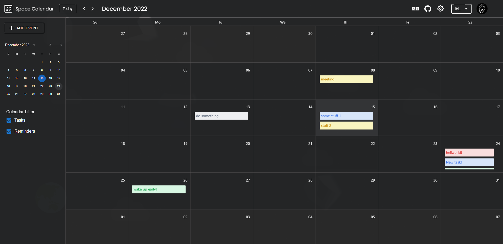
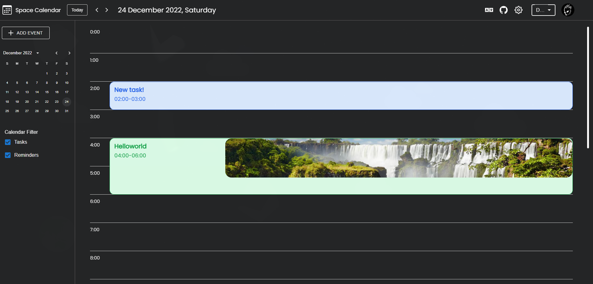

# Space Calendar

Календарь с возможностью планировать свой день.
 
 

 

#### Функционал:

+ Логинизация/Регистрация
+ Изменение профиля (например, аватар пользователя)
+ Возможность добавлять, изменять, удалять задачи
+ Возможность добавлять фон и описание задачам
+ Поддержка двух языков (Английский, Русский)
   
   

#### Советы по использованию:

+ Чтобы создать задачу или напоминание, кликните на свободный час или на кнопку "Создать задачу"
+ Чтобы сделать какие-либо операции с задачей, кликните на нее
+ Сменить язык можно вверху в хедере приложения

#### Основные технологии:

+ React + Redux
+ Node + Express (Сервер)
+ Axios (запросы на сервер)
+ Styled components (стилизация)
+ Material ui
+ React-spring (анимации)
+ React-router v6 (навигация)
+ formik (формы)
+ react-i18next (разные языки)
+ react-icons (Иконки)
+ dayjs (библиотека для работы с временем)
+ react-draggable (Drag'n'Drop)
+ MongoDB (база данных)
+ и другие...

#### Установка:

1. Скачайте репозиторий
2. npm install или yarn
3. npm start / yarn start

